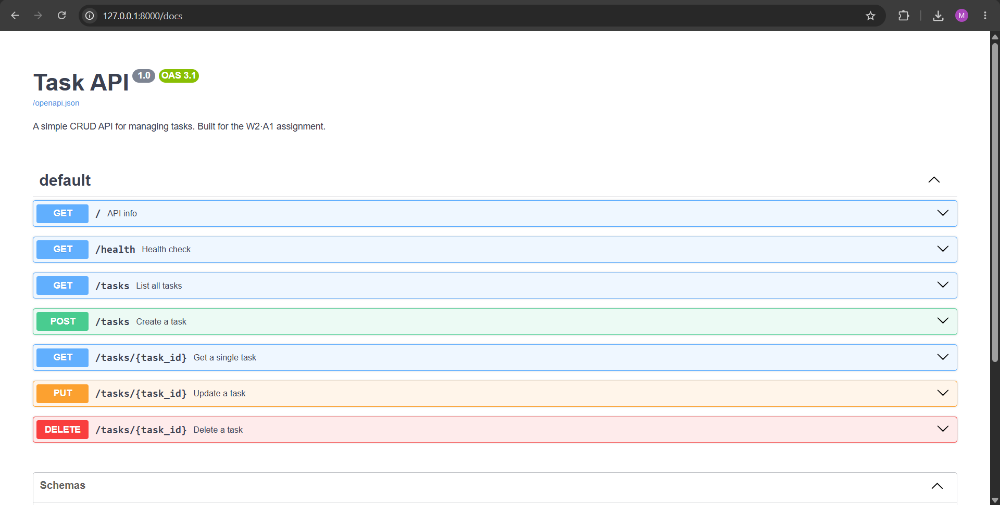

# Secure Task CRUD API (Auth & Protect)

A secure REST API built with **Python + FastAPI**, implementing Authentication and Authorization using **Supabase**.
Data is stored in **PostgreSQL** running in **Docker**.

Built for the **FlyRank backend programme** (Assignment A3: Auth Login & Protect).

---

## Architecture

This project uses **Supabase** as the Identity Provider (IdP) to issue and verify JSON Web Tokens (JWT).
Our API implements a reusable `Middleware` (FastAPI Dependency) that intercepts requests to protected routes, parses the `Authorization: Bearer <token>` header, and verifies the token against Supabase before allowing access.

---

## Prerequisites

- [Docker Desktop](https://www.docker.com/products/docker-desktop) — must be running
- Python 3.10+
- A Supabase Project (free account)

---

## Environment Variables

Copy `.env.example` to `.env` before running:

```bash
cp .env.example .env
```

| Variable | Description |
|----------|-------------|
| `DATABASE_URL` | PostgreSQL connection string for the tasks database |
| `SUPABASE_URL` | Your Supabase Project URL |
| `SUPABASE_KEY` | Your Supabase Anon Public Key |

> ⚠️ **SECURITY NOTE:** `.env` is listed in `.gitignore` and is never committed.

---

## How to Run

1. **Start the database:**
```bash
docker compose up -d
```
*(This starts the PostgreSQL database in the background.)*

2. **Start the FastAPI server:**
```bash
uvicorn main:app --reload
```

---

## API Endpoints

### 🔓 Public Routes (No Auth Required)
| Method | Path | Description |
|--------|------|-------------|
| GET | `/` | API name and version |
| GET | `/health` | Liveness check |
| GET | `/public/info` | Public unprotected data |
| GET | `/tasks` | List all tasks |
| GET | `/tasks/{id}` | Get one task by id |
| POST | `/tasks` | Create a new task |
| PUT | `/tasks/{id}` | Update a task |
| DELETE | `/tasks/{id}` | Delete a task |

*(Note: The CRUD tasks routes from A1/A2 are kept public to maintain backward compatibility, while testing auth on the new routes).*

### 🔐 Authentication Routes (Supabase)
| Method | Path | Status | Description |
|--------|------|--------|-------------|
| POST | `/auth/signup` | 201, 400 | Register a new user with Email/Password |
| POST | `/auth/login` | 200, 401 | Authenticate and receive Access + Refresh JWTs |
| POST | `/auth/logout` | 204, 401 | Logout (Requires Bearer Token) |

### 🔒 Protected Routes (Requires Bearer Token)
| Method | Path | Status | Description |
|--------|------|--------|-------------|
| GET | `/protected/profile`| 200, 401 | Read private user profile metadata |

---

## Swagger UI & Testing

Open **http://localhost:8000/docs** to see the Swagger UI.

Thanks to FastAPI's `HTTPBearer` implementation, Swagger UI automatically understands our security requirements.
To test protected routes:
1. Create a user via `POST /auth/signup`.
2. Login via `POST /auth/login` and copy the `access_token`.
3. Click the **"Authorize" 🔒** button at the top right of Swagger UI.
4. Paste the token and click Authorize.
5. You can now use the `Try it out` button on `GET /protected/profile` and `POST /auth/logout` directly from your browser!



---

## Git Commit History

- Stage 0: setup server and supabase client
- Stage 1: signup and login routes working
- Stage 2: public route and unverified protected route
- Stage 3: profile route token verification
- Stage 4: auth middleware and logout endpoint
- Stage 5: Swagger UI documentation with bearer auth
- Stage 6: publish to GitHub and write README
